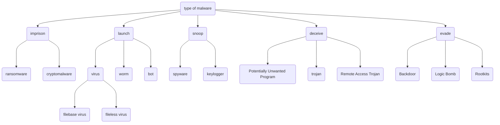

```mermaid
flowchart TD
    cat(type of malware) --> imprison(imprison)
    cat(type of malware) --> launch(launch)
    cat(type of malware) --> snoop(snoop)
    cat(type of malware) --> deceive(deceive)
    cat(type of malware) --> evade(evade)


    imprison(imprison) ---> ransomware(ransomware)
    imprison(imprison) ---> cryptomalware(cryptomalware)


    launch(launch) ---> virus(virus)
        virus(virus) ---> filebase_virus(filebase virus)
        virus(virus) ---> fileless_virus(fileless virus)
    launch(launch) ---> worm(worm)
    launch(launch) ---> bot(bot)

    snoop(snoop) ---> spyware(spyware)
    snoop(snoop) ---> keylogger(keylogger)

    deceive(deceive) ---> pup(Potentially Unwanted Program)
    deceive(deceive) ---> trojan(trojan)
    deceive(deceive) ---> rat(Remote Access Trojan)

    evade(evade) ---> backdoor(Backdoor)
    evade(evade) ---> logic_bomb(Logic Bomb)
    evade(evade) ---> rootkit(Rootkits)
```
